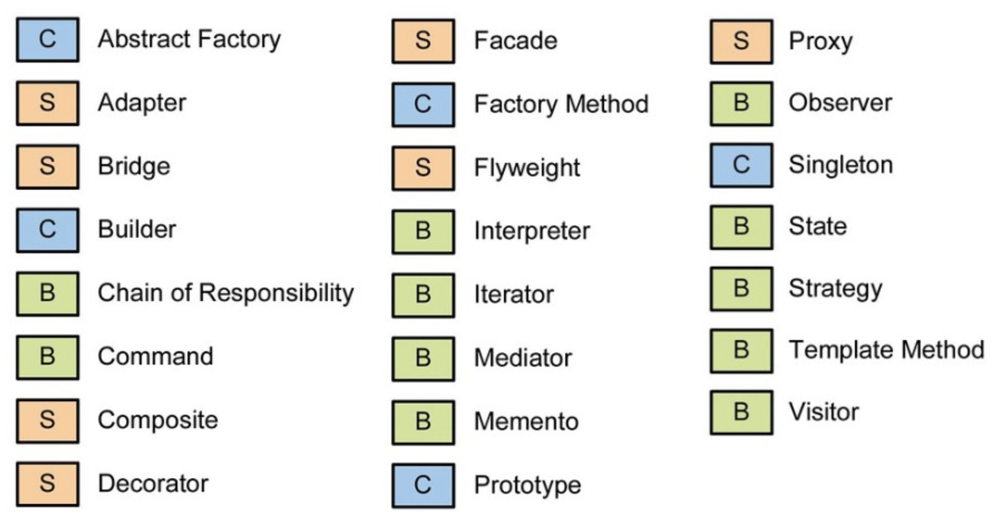

# Patrones GoF

## Types

### Creacionales

Solucionan problemas de creación de instancias, encapsulando y abstrayendo dicha creación.

### Estructurales

Se centran en la composición de clases y objetos para formar estructuras mayores.

### De comportamiento

Resuelven cuestiones algorítmicas y de asignación de responsabilidades entre objetos.

!
