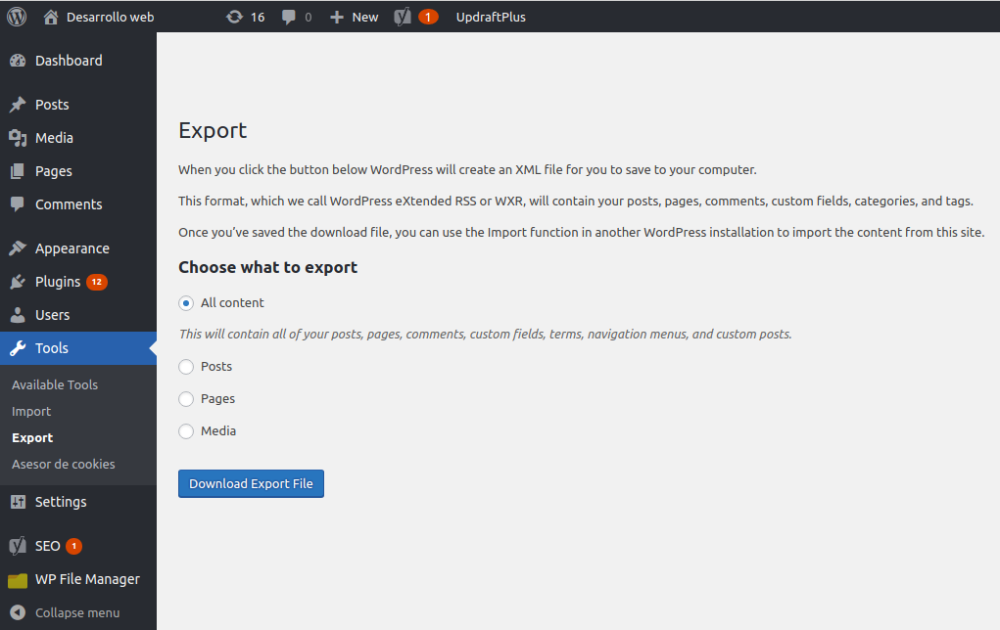

In this case the situation was the end of life of Openshift v2, the platform I used to host (for free) the WordPress blog. As I was not yet accepted in the program of Openshift v3 I decided to try an alternative. So I had access to a static hosting and I moved all the content from Wordpress to Jekyll. Jekyll is a static site generator and as I described in a <a href="/the-undervalued-static-web-sites/" target="\_blank"
 title="The undervalued static web sites">previous post</a> there is nothing bad with that if you use the correct tools.

<!--more-->

In this post I will describe the process I followed to move the content from one kind of blogging platform to the other.


> Jekyll is a simple, blog-aware, static site generator for personal, project, or organization sites. Written in Ruby by Tom Preston-Werner, GitHub's co-founder, it is distributed under an open source license.

## Install Ruby and Jekyll

First of all, I had to instal Ruby. Jekyll is a program written in Ruby, so we need to install it in our development station. In my case, I installed on Ubuntu so install the packages needed is as simple as any other package installation.

```bash
sudo apt-get install gcc ruby ruby-dev libxml2 libxml2-dev libxslt1-dev zlibc zlib1g-dev
```

After that we can install the Jekyll generator by using the Ruby package manager _Rubygems_. Also we will install the Ruby _bundler_ tool for future needs.

```bash

gem install jekyll bundler
```

## Create the new blog with Jekyll

Creating a new blog with Jekyll is as easy as run the following command

```bash

jekyll new _blog_
```

This will generate an example site using the default theme called _Minima_. You can check it by running the command

```bash

jekyll serve
```

This will build the site and start a server in the localhost at the port 4000. Then you can open that [url(http://localhost:4000)] in your browser and see how it looks.

## Import your posts from Wordpress to Jekyll

I went throw some more issues with these steps.

### First attempt Jekyll-exporter Wordpress plugin

I tried first using a plugin that you can find in the Wordpress plugins repository.


It's called [_Jekyll exporter_](https://github.com/benbalter/wordpress-to-jekyll-exporter/) and is developed by [Ben Balter](https://twitter.com/BenBalter)

It worked pretty well, because it exports the posts and a bunch of information like the category, the tags or the author and also some meta data like the page template used and others even it was added by plugins like [Yoast SEO](https://yoast.com/wordpress/plugins/seo/).

**<i class="fa fa-exclamation-triangle" aria-hidden="true"></i> But, I don't know why but maybe is due a missconfiguration the all media is not exported, so in order to do that I tried a second approach.**

### Second attempt using jekyll-import script and default export tool.

Then I exported using the included export tool from the Wordpress administration downloading a file called _wordpress.xml_


After that I installed some gems to get a script able to do the importation

```bash

sudo gem install jekyll-import hpricot open_uri_redirections
```

The important piece is _jekyll-import_ in charge to import all the data included and download all the media refered in the xml export file generated.
This is the script that run the work.

```bash

$ ruby -rubygems -e 'require "jekyll-import";
    JekyllImport::Importers::WordpressDotCom.run({
      "source" => "wordpress.xml",
      "no_fetch_images" => false,
      "assets_folder" => "assets"
    })'
```

Finally, this imported all the posts (published and drafts) and downloaded all images included in the posts from the blog.

For my bad, I had to do a manual match to merge the information exported from one method to the other for each of the posts generated.

## Highlighting code in your Jekyll posts

If you run a blog about development and coding skills sometimes you have to include lines of code on your posts and you need formatting and coloring it in order to be pleasant to the eyes and easy to read.
You can use a highlight helper integrated with Jekyll but you should install the required Ruby gems:

```bash

gem install rouge
```

To colour it properly you will have to add a nice CSS stylesheet. But don't worry because Rouge is completely compatible with [Pygments](http://richleland.github.io/pygments-css/) and you only have to download from there the CSS you want and include it in your project.
The only caveat is that you have to replace the tag with the markdown or html generated from the exports (usually <code>&#96;&#96;&#96;</code> or <code>&lt;pre>&lt;code></code> blocks) with the Jekyll helper for highlighting

```html
 //code here 
```

## Enable latent semantic indexing

The post related content by default with Jekyll provide a simple way to get related content limiting it to the ten most recent posts. If you want to improve this relationship of content you should install also a couple of Ruby Gems more

```bash
sudo gem install classifier-reborn
```

Finally, to take advantage of this, you should build the site using the _--lsi_ option with the jekyll build command.

```bash
jekyll build --lsi
```

## Finish him

After all these steps you will have the content previously created from Wordpress in your new an passionate Jekyll site. From now on, you will be free to write and edit using your HTML skills the content you want in your site.
