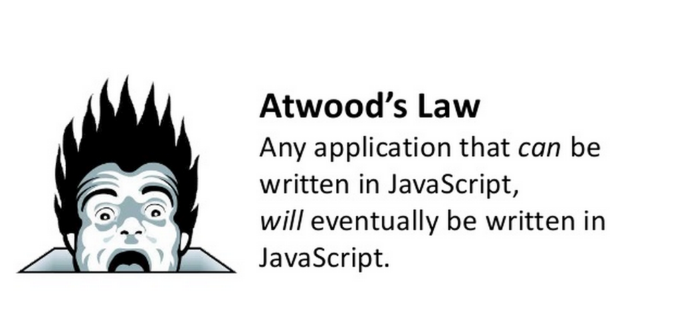

Though I am all in the JavaScript camp when it comes to app development and programming, I fully acknowledge that there are plenty of other <a href="https://fueled.com/services/" target="\_blank"> app development</a> programmers who are not JavaScript fans.

<!--more-->

BUT, the good news is that you do not have to be a JavaScript master to get the flexibility and other benefits that this language, the first platform independent language of all time, offers simply because it is so popular. JavaScript’s status of being one of the widely-used object-oriented languages on the planet has resulted in loads of support tools being created for this language. With these JavaScript app development support tools, you can harness the three main benefits of JavaScript’s scalability, distributed architecture, and multi-platform abilities.

Moreover, new JavaScript app development tools are being created and released all the time, so if you cannot find a solution for your app development issue today, odds are you’ll be able to find one tomorrow. Now, of course, having loads of tools to choose from can be a real challenge all on its own. So, I have done some of the leg work for you and identified the JavaScript app development tools I know can help you. They are:

## Language Compiling Tools

[TypeScript](https://www.typescriptlang.org/), one of Microsoft’s open-sourced programming languages, is a powerful compiler that can truly help you translate your source code into your target’s executable code. TypeScript needs to be in every app development toolbox! Other highly-regarded language compilers are CoffeeScript and Babel. I am a big fan of the latter tool since it is a wiz at translating the very precise ES2015 language into a code that is compatible across multiple browsers. Working, whenever possible, with code that is cross-browser compatible makes app development work much easier and therefore enjoyable.

## JavaScript HTML Template Engines

JavaScript HTML template engines are incredibly simple to work with. If you are going to add HTML to your JavaScript strings, perhaps for a live-streaming app development project, you really need to use a JavaScript HTML template engine so that the HTML structure will automatically be separated from the larger content. My favorite template engine is the pared-down [EJS](http://ejs.co/). I have also used Pug (Jade), doT, Mustache, and Handlebars with success.

## JavaScript Documentation Generators

The finally category of JavaScript tools that can help JavaScript non-experts be the masters of their app development and programming worlds are the JavaScript Documentation Generators. I don’t know about you, but back in the day, one of my least favorite parts of app development was writing the documentation. Thankfully, since JavaScript documentation generators came along, I no longer have to do this dull though necessary task.

[ESDoc](https://esdoc.org/) is my go-to documentation generator because it quickly generates quality documentation, measures its coverage, integrates a manual into the documentation along with test codes, and parses ECMAScript proposals. I’ve worked with plenty of others in app development who swear by Transcription and JSDoc.

## Bottom Line: These Tools Can Make You a JavaScript App Development Master Even If You Do Not Like JavaScript

The tools shared above can truly help you avoid some of the more tedious and difficult aspects to using JavaScript. This is a must because I do believe that app development is largely as Jeff Atwood, founder and builder of StackExchange, said about 10 years ago when he was explaining that the less powerful a language is the more you can do with it, "Any application that can be written in JavaScript, will eventually be written in JavaScript."

Nope, JavaScript ain’t going anywhere; you need to do what you can to embrace it.

> This is a guest post. Michael loves to write on new and engaging technologies. Follow him on his [blog](https://fueled.com/blog).
